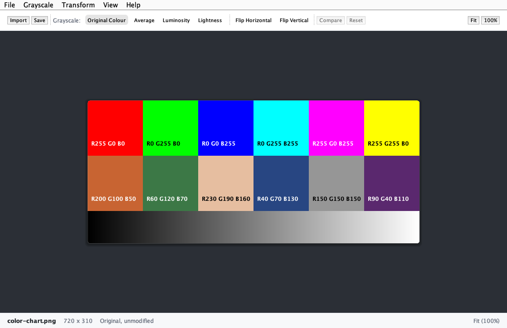
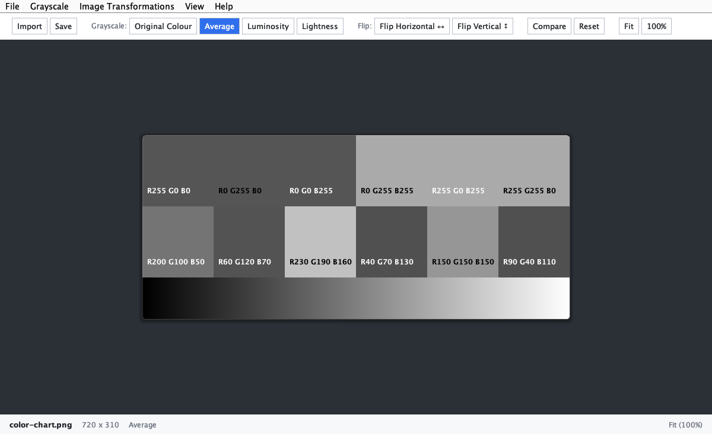
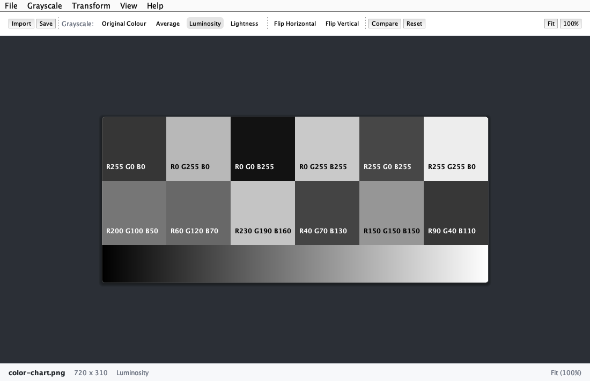
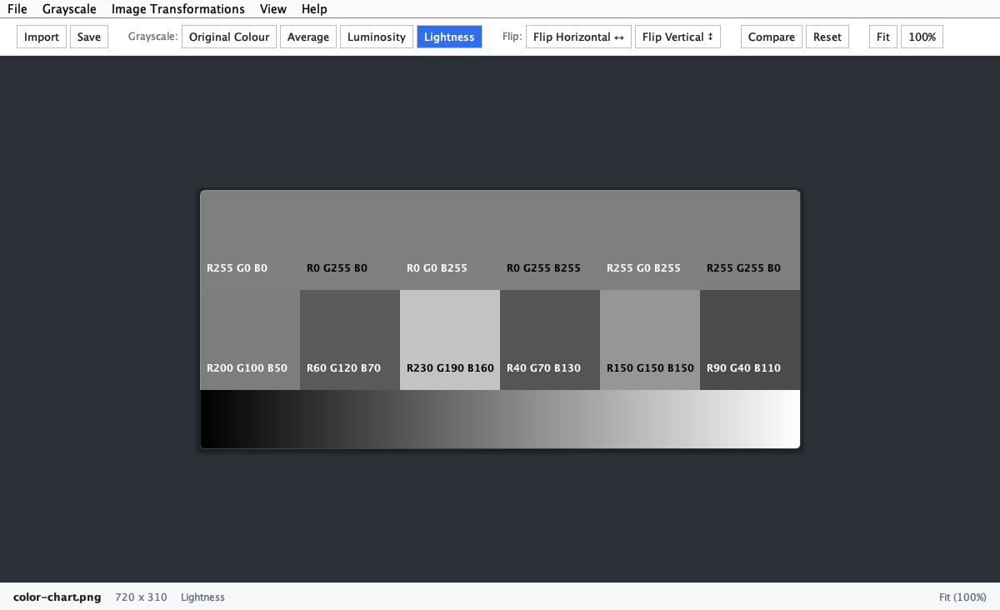
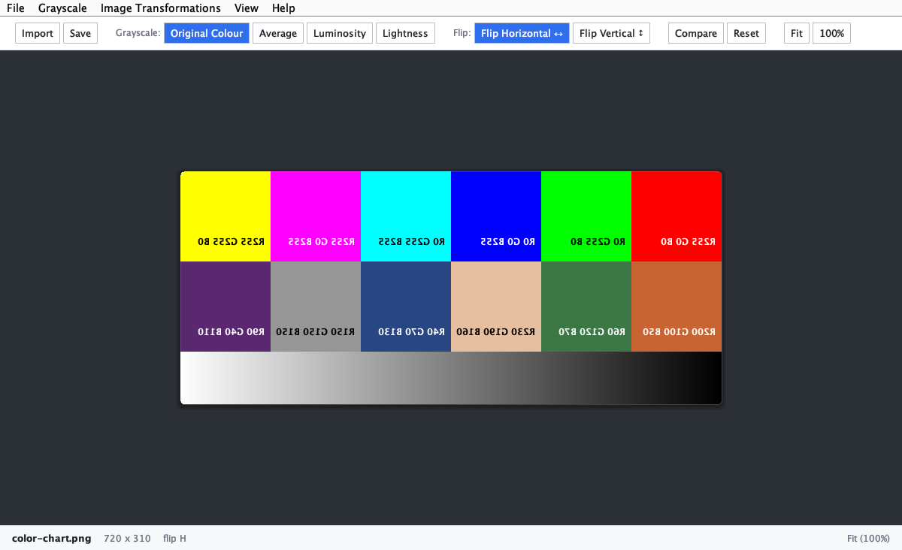
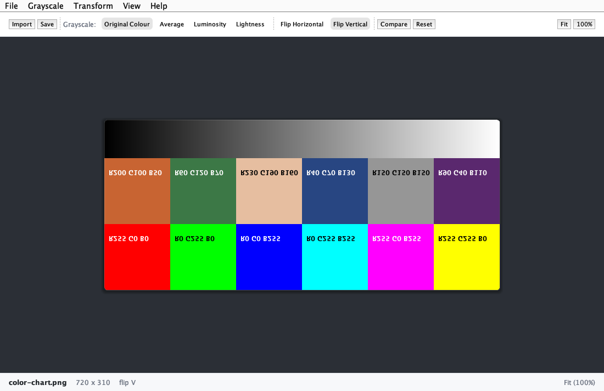
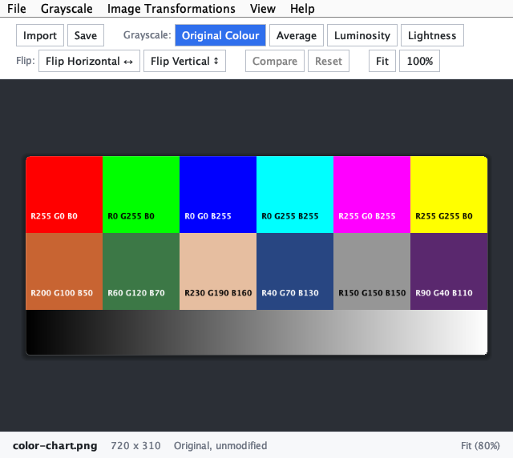

# Image Studio

A Java Swing program for basic image processing. Midterm project, Computer Science Department, Ateneo de Zamboanga University.

## Goal

Import an image, preview it, then:

- Convert it to grayscale with one of three methods: Average, Luminosity, Lightness
- Flip it horizontally or vertically
- Save the result as PNG or JPG

Every operation is in both the menu bar and the toolbar. The window resizes freely, the toolbar wraps on narrow screens, and View > Full Screen (F11, or Ctrl+Cmd+F on macOS) fills the monitor.

## Download

Get `ImageStudio.jar` from the [latest release](https://github.com/ClydeQue/image-studio/releases/latest) and double-click it. Needs Java 21 or newer installed.

If double-clicking does nothing, run `java -jar ImageStudio.jar`.

## How to run from source

You only need a JDK (21 or newer). No libraries.

macOS / Linux:

```
./run.sh
```

Windows:

```
run.bat
```

Or by hand:

```
javac -d classes $(find src -name '*.java')
java -cp classes imagestudio.ImageStudio
```

Try it with the sample image: `./run.sh test-images/color-chart.png`

Run the checks: `java -cp classes imagestudio.verify.SelfTest`

## Screenshots

Imported image



Grayscale: Average, Luminosity, Lightness





Flip horizontal and flip vertical




Narrow window: the toolbar wraps instead of overflowing



Saved output images are in `outputs/`.
