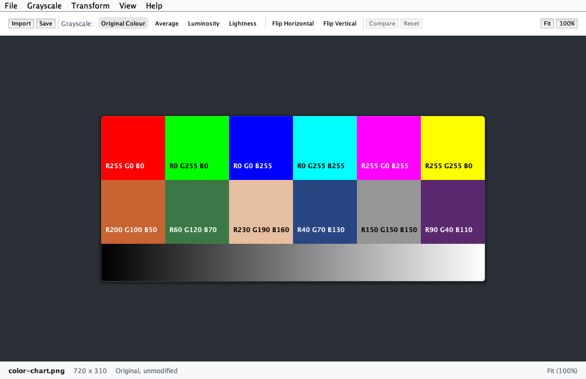
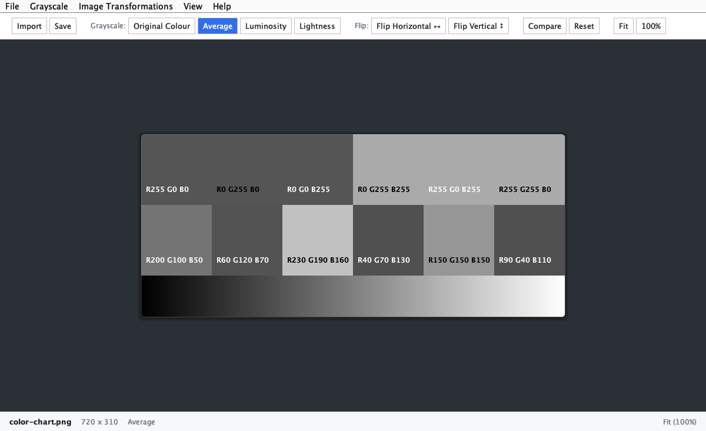
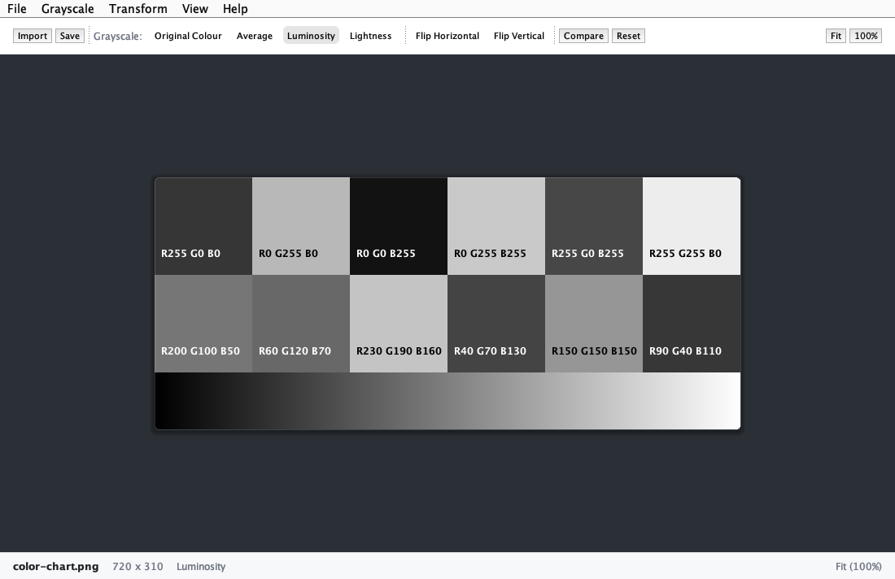
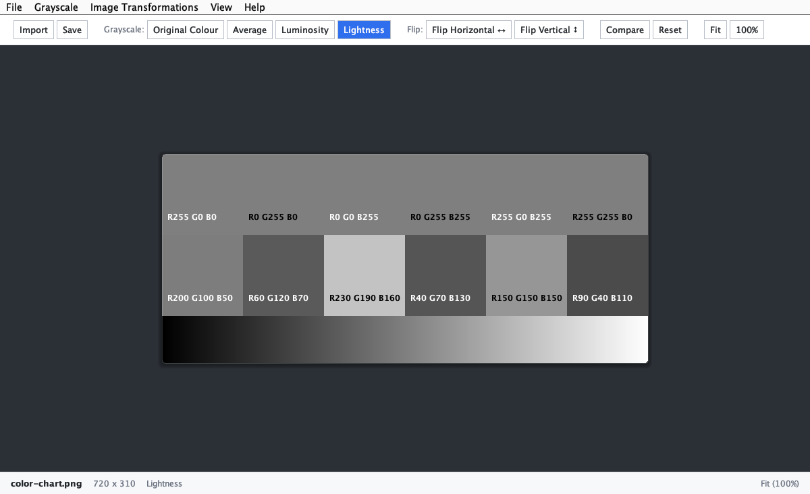
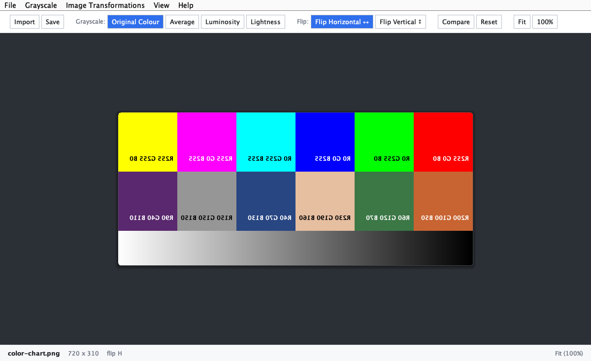
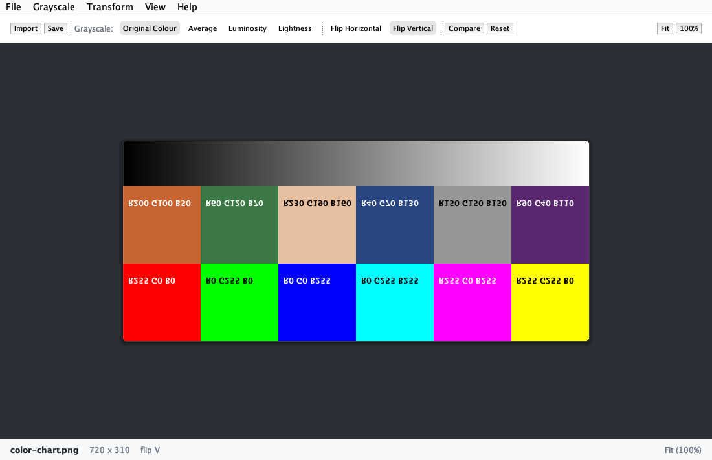
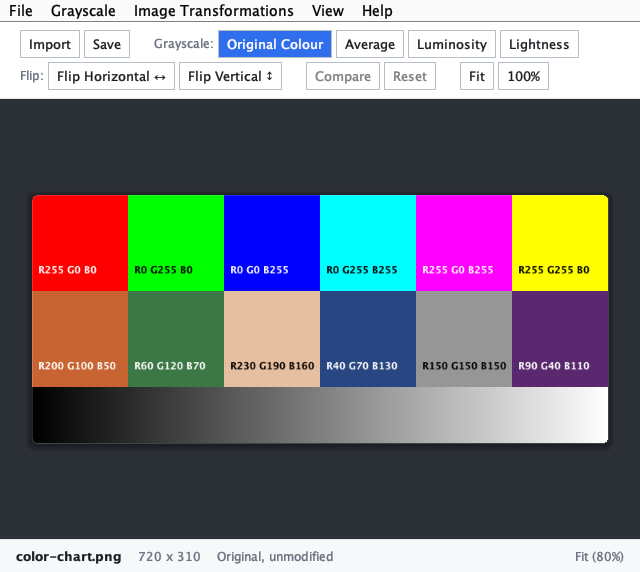

# Image Studio

A Java Swing program for basic image processing. Midterm project, Computer Science Department, Ateneo de Zamboanga University.

## Goal

Import an image, preview it, then:

- Convert it to grayscale with one of three methods: Average, Luminosity, Lightness
- Flip it horizontally or vertically
- Save the result as PNG or JPG

Every operation is in both the menu bar and the toolbar. The window resizes freely, the toolbar wraps on narrow screens, and View > Full Screen (F11, or Ctrl+Cmd+F on macOS) fills the monitor.

## Download (recommended)

The easiest way to run Image Studio is the ready-made `ImageStudio.jar`. No compiling needed.

1. Install Java 21 or newer if you don't have it. Get it free from [adoptium.net](https://adoptium.net).
   Check with `java -version` in a terminal.
2. Download `ImageStudio.jar` from the [latest release](https://github.com/ClydeQue/image-studio/releases/latest).
3. Double-click `ImageStudio.jar`.

If it doesn't open:

- macOS says it can't be opened: right-click the file, choose Open, then Open again.
- Windows opens it as a zip, or nothing happens: open Command Prompt in the Downloads folder and run
  `java -jar ImageStudio.jar`

Using the app:

1. Click Import and pick an image.
2. Pick a grayscale method: Average, Luminosity or Lightness.
3. Click Flip Horizontal or Flip Vertical.
4. Click Save to keep the result.

## How to run from source

Only needed if you want to build it yourself. Otherwise use the download above.

You only need a JDK (21 or newer). No libraries.

macOS / Linux:

```
./run.sh
```

Windows:

```
run.bat
```

Or by hand:

```
javac -d classes $(find src -name '*.java')
java -cp classes imagestudio.ImageStudio
```

Try it with the sample image: `./run.sh test-images/color-chart.png`

Run the image-operation checks: `./selftest.sh`

Code structure:

- `core/ImageDocument`: original image and selected edits.
    - `core/ImageRecipe`: fixed settings captured before background rendering.
    - `core/ImageInfo`: file details exposed to the UI without editable document state.
- `core/GrayscaleMethod`: each enum constant provides its own grayscale formula.
    - `core/ImageOps`: shared pixel operations.
- `io/ImageFileService`: image reading and writing without Swing dialogs.
    - `ui/ImageFileDialogs`: file selection and overwrite confirmation.
- `ui/StudioController`: background work and view notifications.
    - `ui/MainWindow`: assembles the interface.
- `ui/StudioActions`: commands reused by the menu and toolbar.
    - `ui/ControlBindings`: keeps their enabled and selected states in sync.

The self-test checks formulas, flips, transparency, scaling and output filenames.
It runs without opening the application window.

Implementation notes:

- Average: `(R + G + B) / 3`.
    - Integer division drops the fractional part.
- Luminosity: `(21 * R + 72 * G + 7 * B + 50) / 100`.
    - The weights are `0.21`, `0.72` and `0.07`.
    - Adding `50` rounds the result to the nearest whole level.
- Lightness: `(max(R, G, B) + min(R, G, B)) / 2`.
    - The middle channel does not affect the result.
- Flip Horizontal: reverses columns across the vertical axis.
    - Source column: `width - 1 - x`.
- Flip Vertical: reverses rows across the horizontal axis.
    - Source row: `height - 1 - y`.
- Edits always start from the imported image.
    - Switching grayscale methods preserves the original colour information.
    - Applying the same flip twice cancels it.
- Background workers receive a fixed recipe.
    - Results from an older request are discarded.
    - Save stays disabled while loading, rendering, saving or comparing the original.
- Export writes a temporary file before replacing the destination.
    - A failed encoder preserves the existing file.
    - JPEG exports composite transparency onto white.
- Preview scaling and export are separate.
    - Zoom changes the displayed size.
    - Export keeps the image's pixel dimensions.

## Screenshots

Imported image



Grayscale: Average, Luminosity, Lightness





Flip horizontal and flip vertical




Narrow window: the toolbar wraps instead of overflowing



Saved output images are in `outputs/`.
